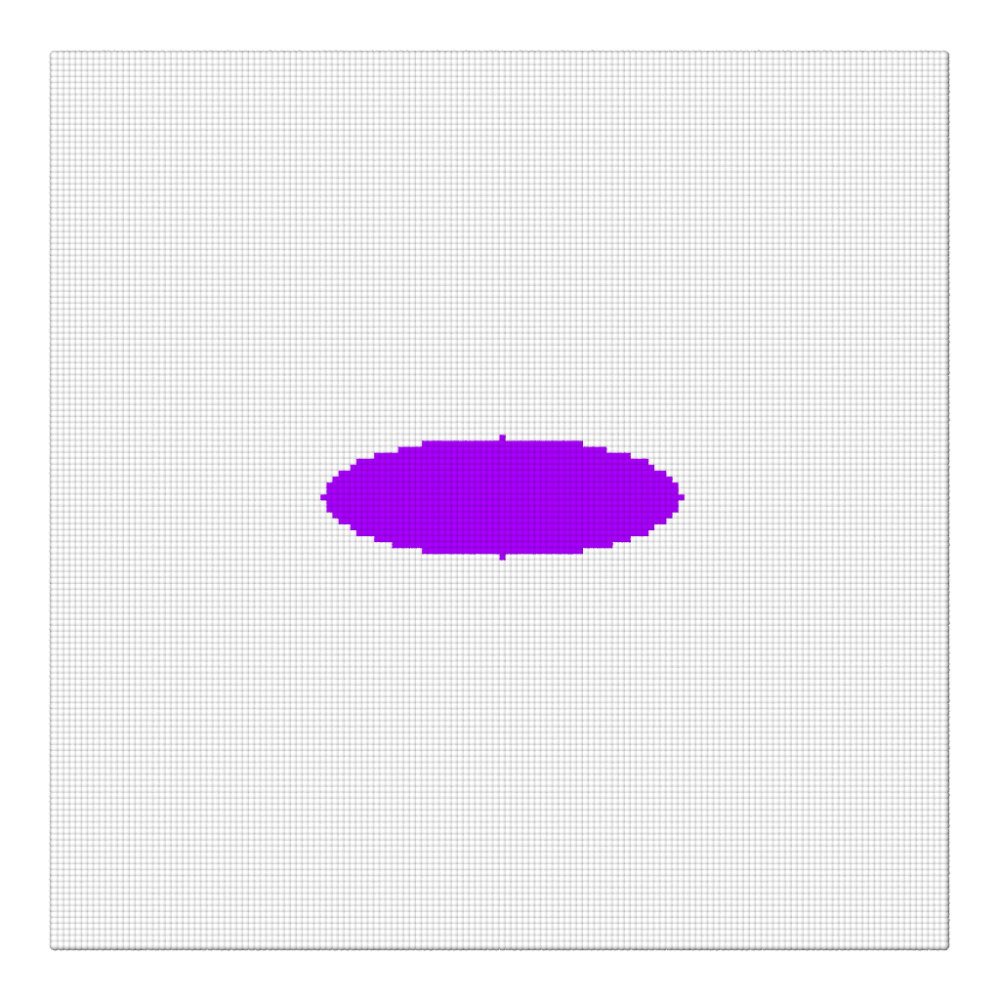

# Retraction of a stretched droplet

To run the case, execute the following command in the terminal:

*lmp_mpi <in.sdpd_phase.2d*

This case is used for static validation of the model. It shows the evolution of an initially oval droplet which, due to surface tension effects, transforms into a circular shape. Validation is performed by measuring the Taylor deformation parameter, which depends on several factors, including the ratio between fluid viscosities $\lambda$. Validation for various values of $\lambda$ is shown in Figure 1(b). The current code reproduces the case for $\lambda=10$. To reproduce all the curves in the figure, vary the viscosities $\eta_{11}$ and $\eta_{22}$, i.e., the value of $\lambda$.
