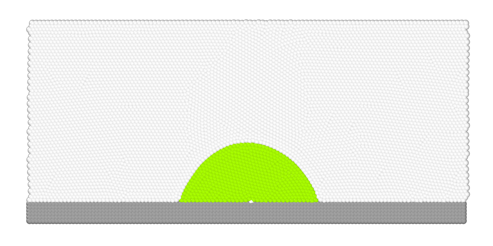

# Static contact angle between droplet and solid wall

To run the case, execute the following command in the terminal:

*lmp_mpi <in.sdpd_phase.2d*

This case is used for static validation of the model. This involves analyzing the contact angles between fluid droplets and solid walls. Validation for angles between 0º and 110º can be seen in Figure 1(c). The case described here is for an angle of 80º. To replicate the entire curve in the figure, the strength factor value must be varied between the droplet and the wall (for angles less than 90º) and between the fluid and the wall (for angles greater than 90º). 
