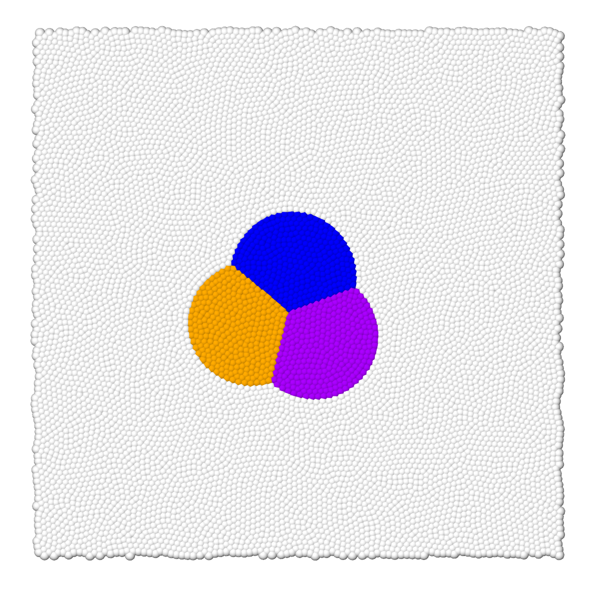

# Triple contact angle between three diferents droplets

To run the case, execute the following command in the terminal:

*lmp_mpi <in.sdpd_phase.2d*

This case is used for static validation of the model. This involves analyzing the contact angle between three droplets immersed in a liquid phase. When a stable state is reached, the three droplets form a 120º angle between them. This simulation has two parts: first, it runs with thermal fluctuations (kBT different from 0), and then the fluctuations are suppressed (kBT=0). The initial state versus the final state can be seen in detail in Figure 1 (c).
