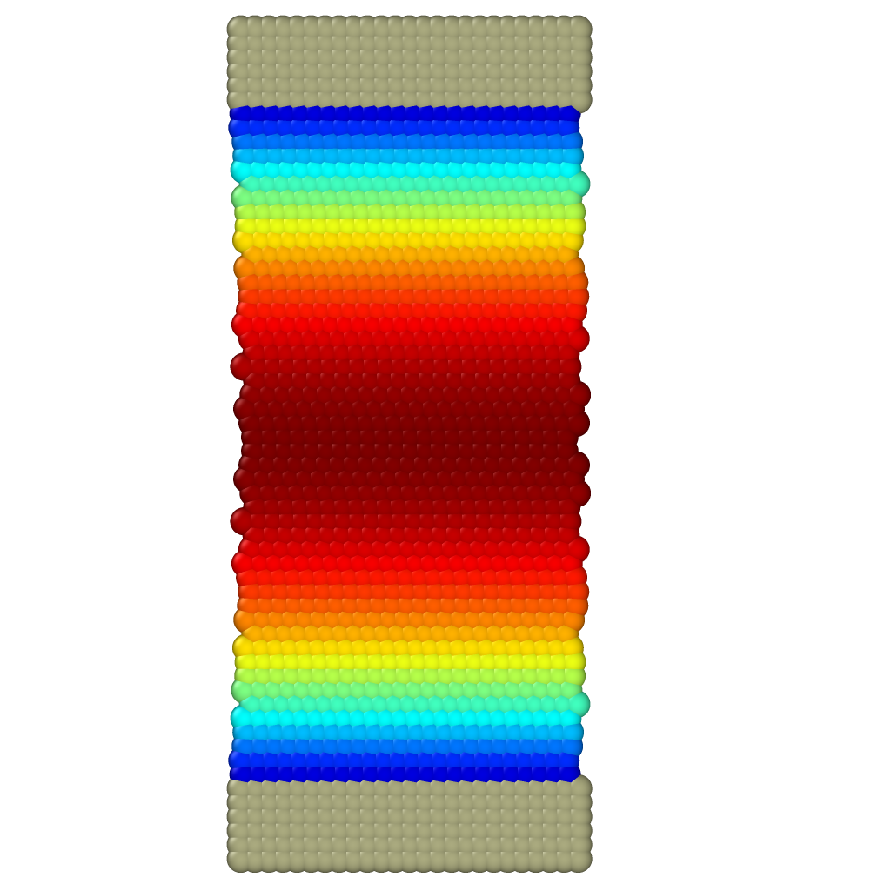

# Poiseuille flow for one phase

To run the case, execute the following command in the terminal:

*lmp_mpi <in.sdpd_phase.2d*

This case is used for dynamic validation of the model. This is a channel with a single-phase Poiseuille flow. The case shown here is for a Reynolds number equal to 0.1. The flow is imposed through a body force f_g which can be varied to obtain different fluid velocities. The validation of both velocity profiles and stress profiles for different Reynolds numbers can be seen in Figure A.12_(a) and A.12_(d), respectively.  
