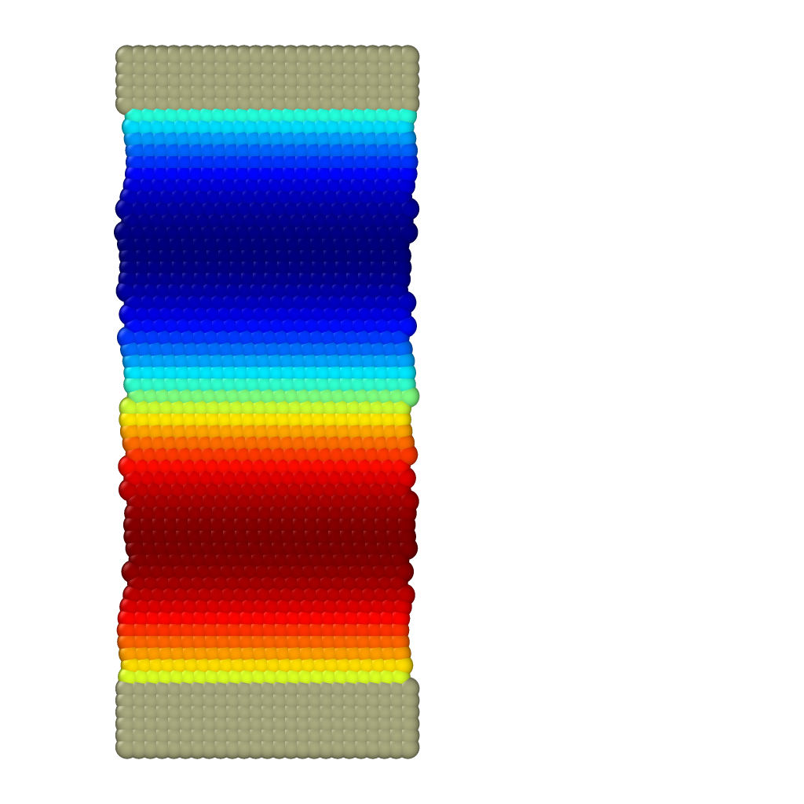

# Poiseuille flow for two phases

To run the case, execute the following command in the terminal:

*lmp_mpi <in.sdpd_phase.2d*

This case is used for dynamic validation of the model. This is a channel with a Poiseuille flow with two phases.  The flow is imposed by a body force f_g, which can be varied to obtain different fluid velocities. We evaluate the variation of the viscosity ratio $\lambda$ between phases. Validation for various values of $\lambda$ is shown in Figure 2(a). The current code reproduces the case for $\lambda=10$. To reproduce all the curves in the figure, vary the viscosities $\eta_{11}$ and $\eta_{22}$, i.e., the value of $\lambda$.
