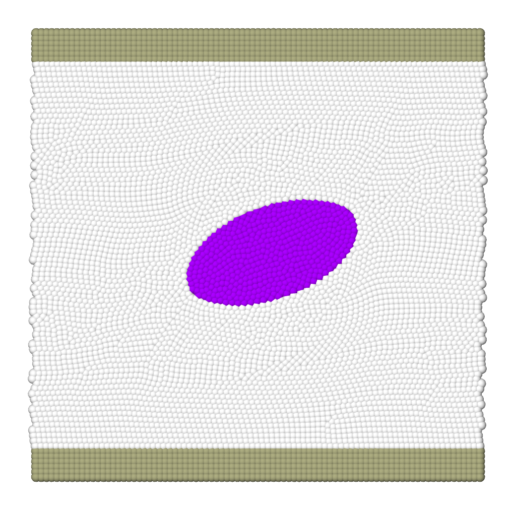

# Taylor deformation vs capillary number 

To run the case, execute the following command in the terminal:

*lmp_mpi <in.sdpd_phase.2d*

This case is used for dynamic validation of the model. This case deals with the dynamics of a droplet subjected to a shear flow.  The flow is imposed by a velocity $U$ of equal magnitude and opposite directions on each wall of the channel. Figure 2 (b) shows the variation of the Taylor parameter (droplet deformation) against the capillary number.  This example reproduces the specific case of Ca=0.2. To modify this number, vary the fluid velocity in the channel.
