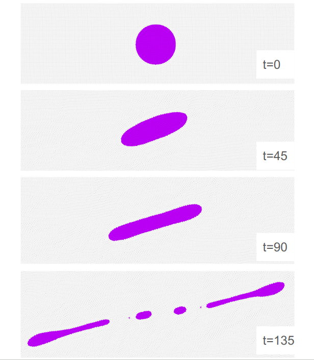

# Droplet break-up

To run the case, execute the following command in the terminal:

*lmp_mpi <in.sdpd_phase.2d*

This case is used for dynamic validation of the model. This case deals with the dynamics of droplet break-up.  The flow is imposed through a velocity $U$ of equal magnitude and opposite directions on each wall of the channel. Figure 2 (c) shows the break-up phenomenon.  This case reproduces the specific case of Ca=0.9.
