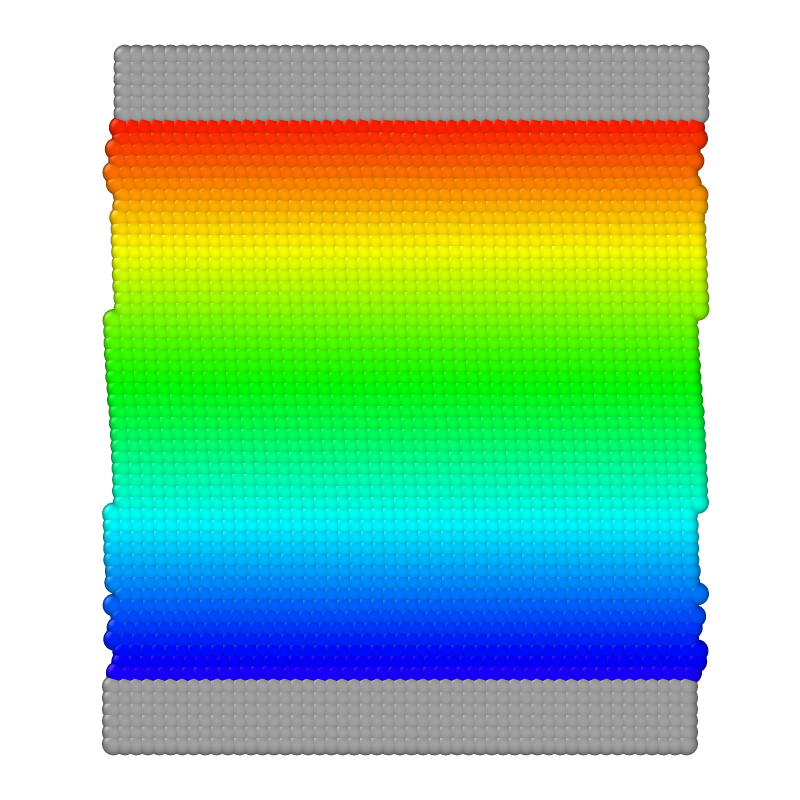

# Thixotropic shear flow in a channel 

To run the case, execute the following command in the terminal:

*lmp_mpi <in.sdpd_phase.2d*

This case is used for thixotropic validation of the model. This case deals with the thixotropic behavior of a fluid subjected to shear flow.  The flow is imposed by a velocity $v$ of equal magnitude and opposite directions on each wall of the channel. Figure 3 (a) shows the variation of effective viscosity against shear rate.  This case reproduces the specific case of $\alpha=4$ and $\gamma=0.9$. To replicate all the curves in the figure, vary the fluid velocity in the channel and the factor $\alpha$.
 
