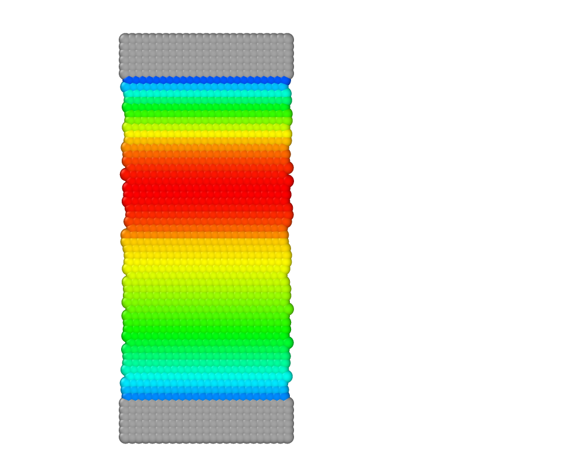

# Poiseuille flow for two phases with one thixotropic phase

To run the case, execute the following command in the terminal:

*lmp_mpi <in.sdpd_phase.2d*

This is the second exploratory case that we study with our model. Here we explore the temporal evolution of velocity profiles in a channel with two-phase flow, where one phase is Newtonian and the other is thixotropic. The temporal evolution for a channel with $\alpha=4$ is shown in Figure 8. To reproduce other profiles, vary the thixotropic parameters of the fluid.
