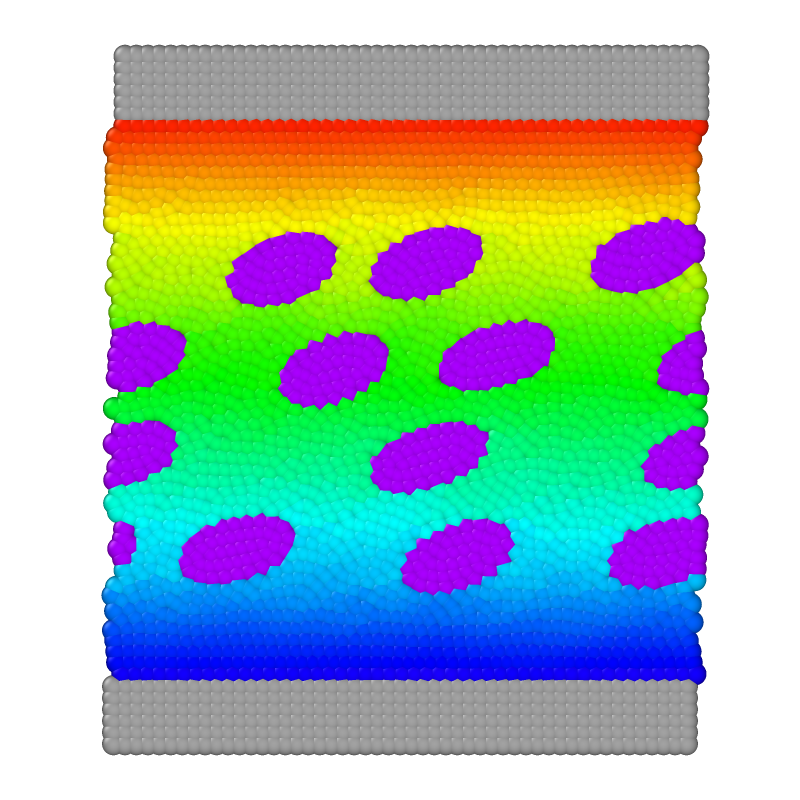

# Emulsion with thixotropic continuous phase and newtonian droplets

To run the case, execute the following command in the terminal:

*lmp_mpi <in.sdpd_phase.2d*

This is the second exploratory case that we study with our model. This corresponds to the transport of Newtonian droplets immersed in a continuous thixotropic phase. It is possible to monitor the temporal evolution of viscosity by measuring the force on the walls. The case presented here has a particle concentration of 30%. Figure 9 shows the temporal evolution of viscosity for different particle concentrations. To reproduce the graph, vary the concentration percentage by adding or removing droplets in the “*atomsData2*” script.
