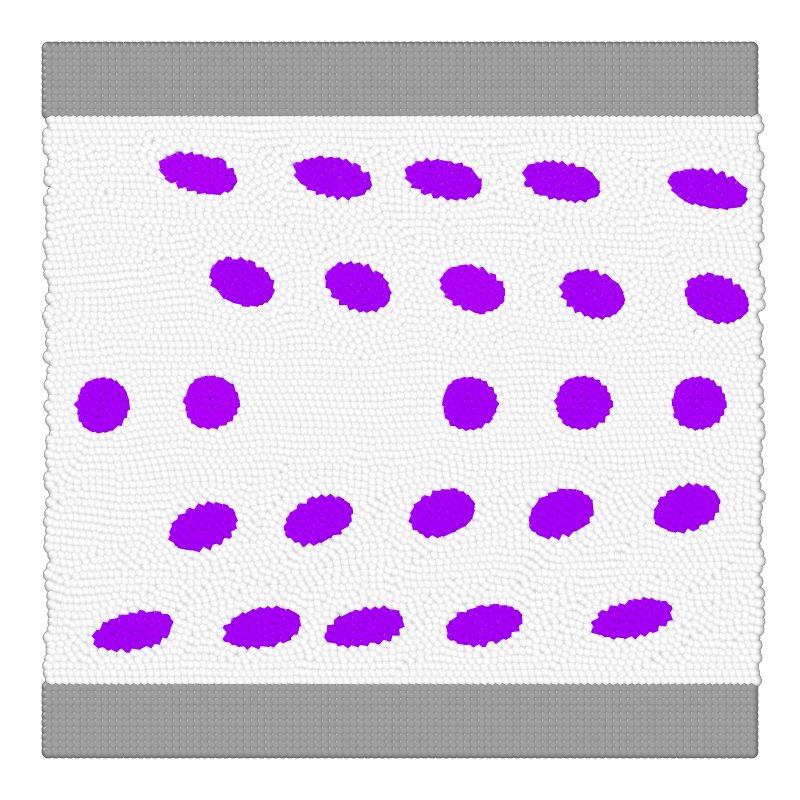

# Emulsion with newtonian continuous phase and thixotropic droplets 

To run the case, execute the following command in the terminal:

*lmp_mpi <in.sdpd_phase.2d*

This is the second exploratory case that we study with our model. 
