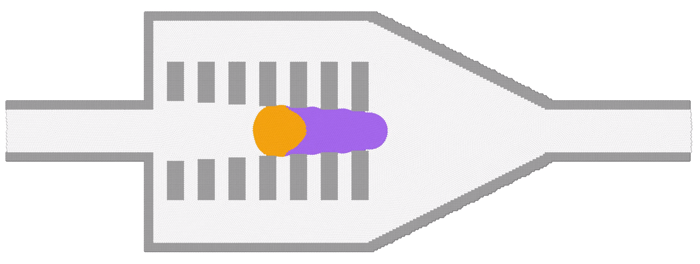

# Droplet merging using micro-devices

To run the case, execute the following command in the terminal:

*lmp_mpi <in.sdpd_phase.2d*

This is the fourth exploratory case that we study with our model. 
